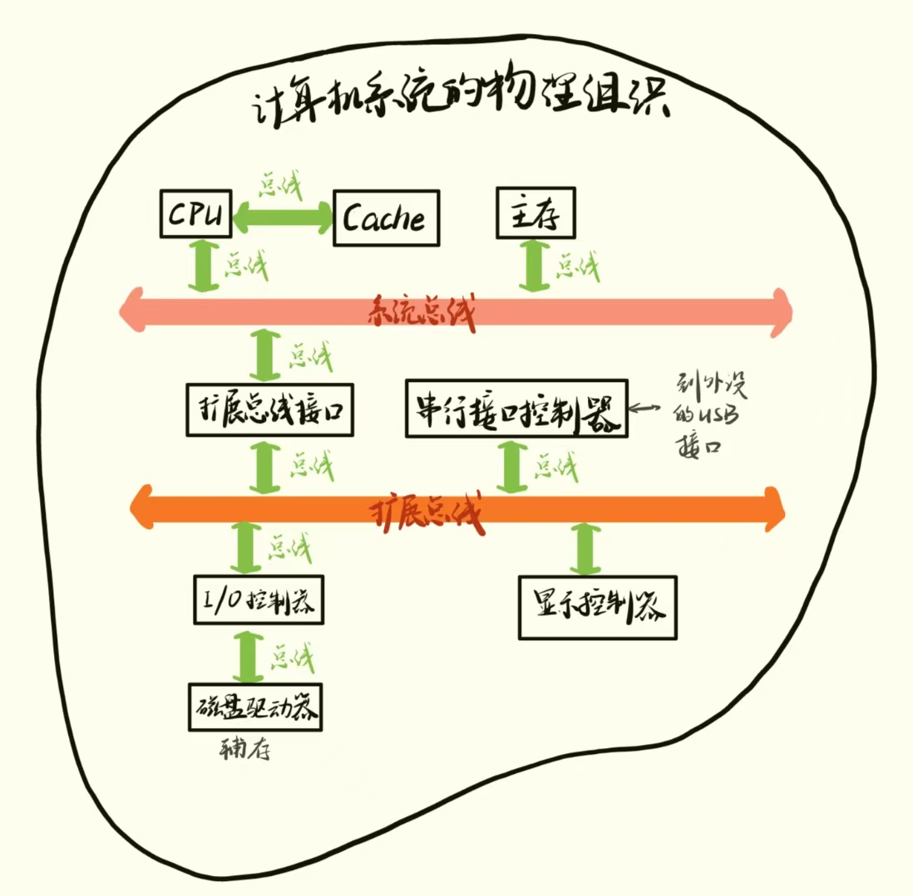
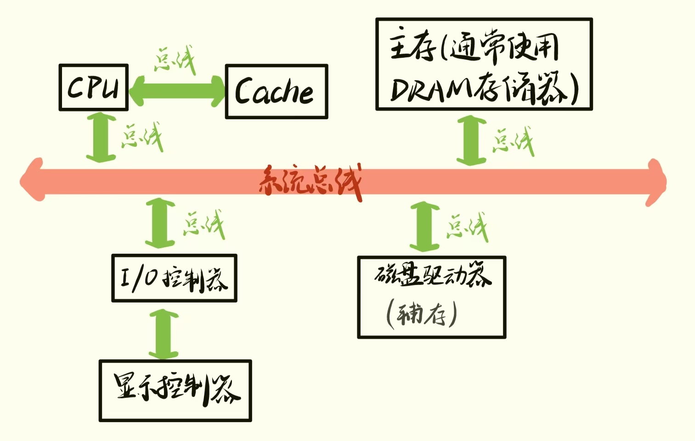

## 大概

先提个概念，其内含后面会讲。

首先介绍术语 “体系结构” 的三种用法：

 - **指令集体系结构**（ISA）：描述了程序员看到的计算机的抽象视图，并且定义了汇编语言和编程模型。之所以称其为“抽象”，是因为其并没有考虑计算机的实现过程（硬件的具体实现细节）。
 - **微体系结构**：描述了一种指令集体系结构的实现方法。（也就是关注计算机的内部设计）
 - **系统体系结构**：关注整个系统（包括处理器、存储器、总线和外设等）。

计算机系统体系结构概览

影响计算机设计的因素有：技术、异常处理、性能、应用、操作系统、编译器、功耗。

其中，功耗是当前计算的关键因素，因为它必须尽可能小。为了避免处理器因过热而损坏，高性能计算机必须降低功耗，而为了延长电池寿命，便携系统也必须减少功耗。

## 什么是计算机系统体系结构

 - 什么是计算机系统体系结构？

计算机系统包括读取并执行程序的中央处理单元（central processing unit，CPU），保存程序和数据的存储器，以及将芯片转换为实用系统的其他子系统（这些子系统会使CPU与显示器、打印机、Internet等外部设备之间的实用系统的其他子系统）。而不是一个微处理器（microprocessor）或者是一块芯片（chip）。

这里的微处理器其实是指在单个硅片上实现的CPU。而在计算机中实际执行程序的部分CPU，其实称作 “处理器”。

这让我想到初中的“微机课”，这里的“微机”就是指围绕着微处理器构建的计算机。由于以及没有必要再区分哪些计算机拥有多个独立的集成电路，哪些计算机只有微处理器，因此”微机“一词的使用频率在不断降低。

计算机的性能不仅仅取决于CUP，还取决于其他子系统的性能。如果不能高效地进行数据传输，仅仅提高CPU的性能是毫无意义的。计算机科学家曾开玩笑说，提高微处理器的性能只不过是让CPU更早地开始等待来自存储器或磁盘驱动器的数据。
其实计算机不同组成部分的性能提升速度是当前计算机系统设计者面临的主要问题，因为各个部分的性能提升速度并不一致。例如，过去几十年中，处理器的性能持续高速增长，而硬盘的性能（访问时间）在过去30内几乎保持不变。不过随着固态盘（solid state disk，SSD）等半导体硬盘开始取代机械硬盘，这种窘境有可能结束。

### 通用计算机

下图描述了一个简单的通用计算机（如个人计算机或工作站）结构。

图中的Cache位于CPU外，但其实目前绝大多数处理器都在CPU内集成了片上Cache。

信息（即程序和数据）保存在存储器中。为了实现不同的目标，真实的计算机会使用不同类型的存储器。例如，使用寄存器和缓存提供高速访问，使用主存和硬盘提供大容量存储，同时使用ROM来存储启动固件或其他不经常变动的数据。