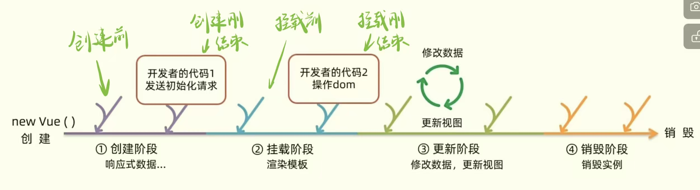

## Vue生命周期和生命周期的四个阶段

思考：
- 什么时候可以发送初始化渲染请求？（越早越好）
- 什么时候可以开始操作dom？（至少dom得渲染出来）

如图所示是Vue的生命周期的四个阶段：
1. 创建阶段（响应式数据，只执行一次）
2. 挂载阶段（渲染模板，只执行一次） ^5e015c
3. 更新阶段（数据修改，更新视图；可执行多次，只有数据更新才会执行） ^903219
4. 销毁阶段（销毁实例，例如关闭页面时）

可以得出：在创建阶段刚结束时可以发送初始化渲染请求；在挂载阶段刚结束时可以开始操作dom。

## Vue 生命周期函数（钩子函数）

^5e7968

Vue 生命周期过程中，会自动运行一些函数，被称为 `生命周期钩子` => 让开发者可以在特定阶段运行自己的代码。

可以看成有四对钩子函数：

分别分布于每个阶段开始前和结束后。

若想检测`beforeDestroy()` 和 `destroyed()` 两个钩子函数是否执行，可以在inspect页面时，在`Console` 中输入指令`app.$destroy()` 就可以把当前实例卸载掉。（该指令卸载掉Vue实例后，虽然页面中还是能看见渲染内容，但是事件监听那些都不起作用，可以理解为现在的这个dom和Vue已经没有任何关系了（卸载成功））
因此，我们一般会在`卸载阶段` 的 `beforeDestroy()`中清除掉一些Vue以外的资源占用，例如：定时器、延时器......   以起到性能优化的作用。

接下来举两个例子：
[created应用](created应用.md)
