题目链接：[376. 摆动序列 - 力扣（LeetCode）](https://leetcode.cn/problems/wiggle-subsequence/submissions/684983404/)

斯，刷完感觉还是云里雾里的感觉
```
class Solution {
    public int wiggleMaxLength(int[] nums) {
        if (nums.length <= 1)
            return nums.length;
        // 若数组长度为2
        if (nums.length == 2 && nums[0] != nums[1])
            return 2;
        else if (nums.length == 2 && nums[0] == nums[1])
            return 1;

        // 数组长度大于2
        int preL = 0;
        int preM = 0;
        int preR = 0;
        int pre = 0;
        int cur = 0;
        int result = 2;
        boolean is2 = true;

        if (nums[1] - nums[0] == 0)
            result = 1;

        while (true) {
            preM = preL + 1;
            preR = preM + 1;
            if (preR > nums.length - 1)
                break;
            pre = nums[preM] - nums[preL];
            cur = nums[preR] - nums[preM];

            //判断是否为摆动序列

            if ((pre <= 0 && cur > 0) || (pre >= 0 && cur < 0))
                result++;
            if (!(pre == 0 && cur == 0))
                is2 = false;
            preL++;

        }

        if (is2 && result == 2)
            return 1;
        else
            return result;
    }
}
```
起初我想的比较简单，我将返回值初始化为2，当遇到`(pre <= 0 && cur > 0) || (pre >= 0 && cur < 0)`这种情况的时候就加一。（这里面的`pre`和`cur`分别指的是）

## 重新理清思路

我们就主要讨论数组的长度大于2的这个情况。

由于要判断数组是否为摆动，我们就通过两元素之间的差值进行判断，若元素间的差值为正负相交替，那就是摆动序列，但是我们难免会遇到一些不是摆动的情况：
***连续增长、连续减小以及连续相同***

由于我们最后需要得到的仅仅是摆动序列的数组长度，所以，当我们遇见连续增长、连续减小以及连续相同的情况时，我们没必要真正地将中间的元素给去掉，而是直接“跳过”。
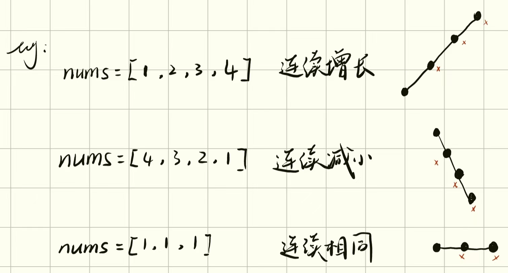

我们用`pre`和`cur`这两个变量来记录元素中的差值，例如：
判断数组`nums = [1,7,4,9,2,5]`是不是摆动序列，先大致画一下这个数组各元素的大小情况。
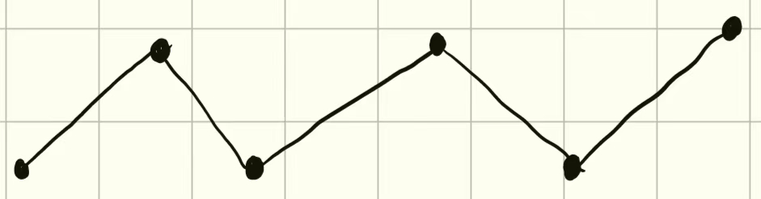
==先初始化结果为1（也就是先将数组中第一个元素计算为摆动序列的一部分），==接着，如果我们直接将第一段记为`pre`，第二段记为`cur`。
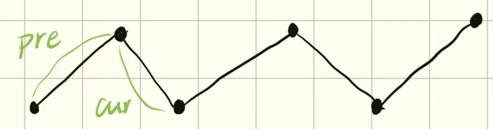
由于这两段满足摆动序列的要求，所以我们应该将`pre`和`cur`中间的那个元素加到摆动序列的一部分，但是第一个元素就被我们遗漏了，下一步我们将cur往后移动，继续将`pre`和`cur`中间的元素加入摆动序列：
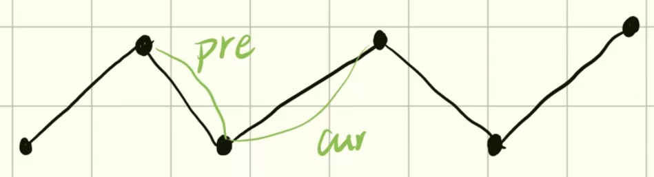
那第一个元素怎么办？有一个方法是将`result`初始化为1，因为数组的第一个元素都会加入摆动序列中（在删除多余元素保留第一个元素的前提下）；还有一个方法是，模仿前面的动作，指的是每次增加到摆动序列中的元素都是将两个“指针”夹着的那个元素，所以，我们可以想办法将`pre`和`cur`也能移动到第一个元素的左右——也就是在第一个元素前再加一个元素。
也就是复制数组的第一个元素，再将其加到数组的最前面：
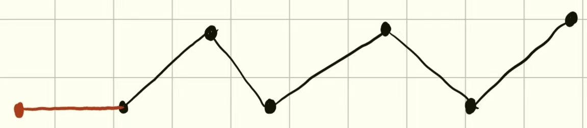
这样，我们从头开始计算，就能将第一个元素算进去了。
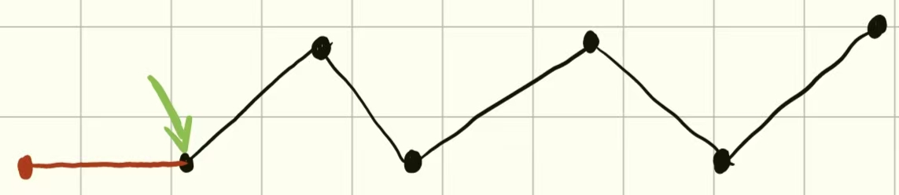

接着，当我们遇到连续增长、连续减小或者连续相同的情况呢？下面是个例子：判断数组`nums = [4,1,1,1,9,2,5]`是不是摆动序列。我们先大致画一下这个数组各元素的大小情况。
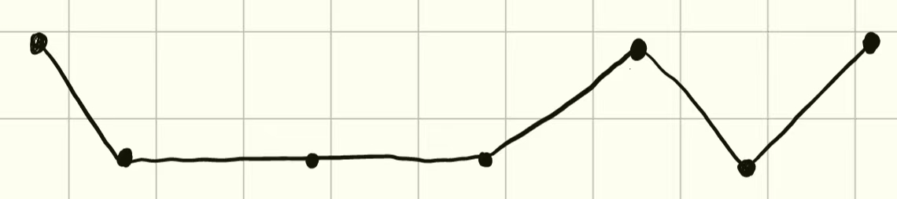

按照前面所说，先处理成下面的效果：
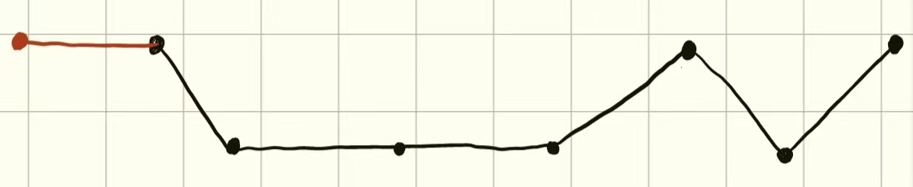
当计算到这一步时，我们发现


下面是个例子：判断数组`nums = [1,1,1,9,2,5]`是不是摆动序列。我们先大致画一下这个数组各元素的大小情况。
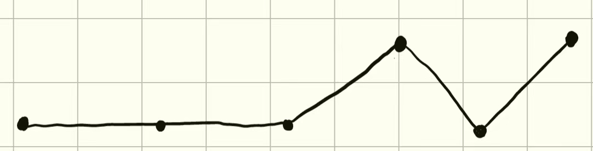
按照前面所说，先处理成下面的效果：
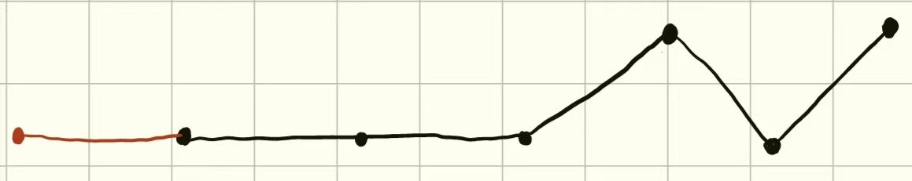
开始计算：
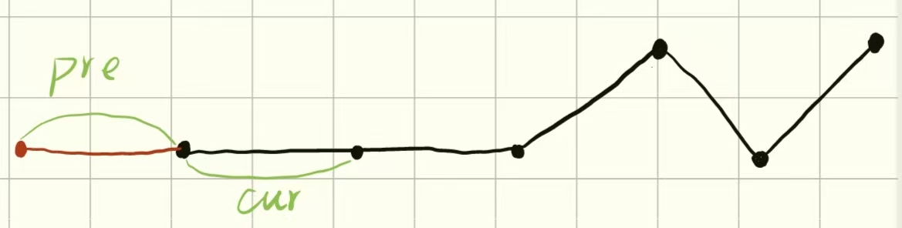

由于这里的`cur`的值与`pre`相同，所以应该跳过这个点。这里有两种方法：一种是`pre`和`cur`一起往后跳，始终只夹着一个一个点；另一种是，`pre`留在原地，`cur`往后跳（可以理解成将`pre`与`cur`中间相隔的点和线都看作只剩一个点，即跳过了多余的线和点）


这次也满足摆动序列，但是新加入的元素就只有一个了，往后推都是只有一个。
难道我们需要把第一次单独拎出来作为特殊情况吗？
我尝试过一种情况：直接将`result`的初始值设为2不就行了。
但是！当遇到`nums = [0, 0, 0]`这种情况，或者递增数组、递减数组，就不起作用了。
有个很巧妙的解决方法就是，将数组的第一个元素复制一份再插入数组的第一个位置：

再从红色这段开始，当`pre >= 0 && cur < 0`或`pre <= 0 && cur > 0`时，`result`就加一。
当`pre == 0 && cur < 0`或`pre == 0 && cur > 0`时为什么也要加一呢，本质上是将`pre`和`cur`两段中间的那个元素加入摆动序列中：


我们用`pre`和`cur`这两个变量来记录元素中的差值，例如：
判断数组`nums = [1,1,1,9,2,5]`是不是摆动序列，先大致画一下这个数组各元素的大小情况。
接着先分别计算前两段的差值，都为0，也就是`pre = 0;cur = 0`。
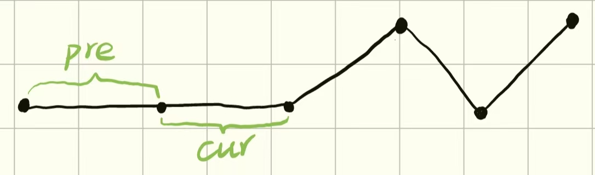

很明显，这是两段连续相同的元素，所以我们应该跳过它们