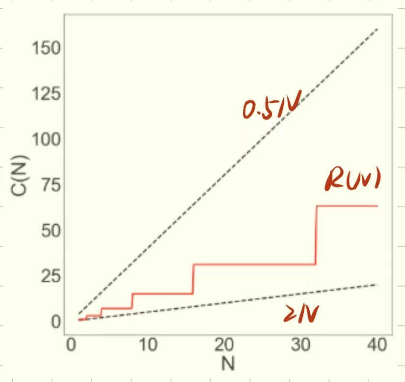
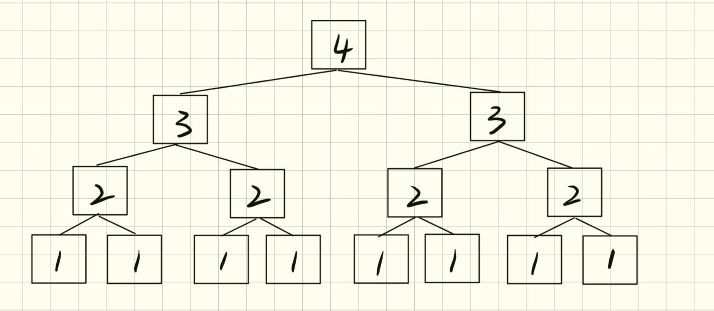
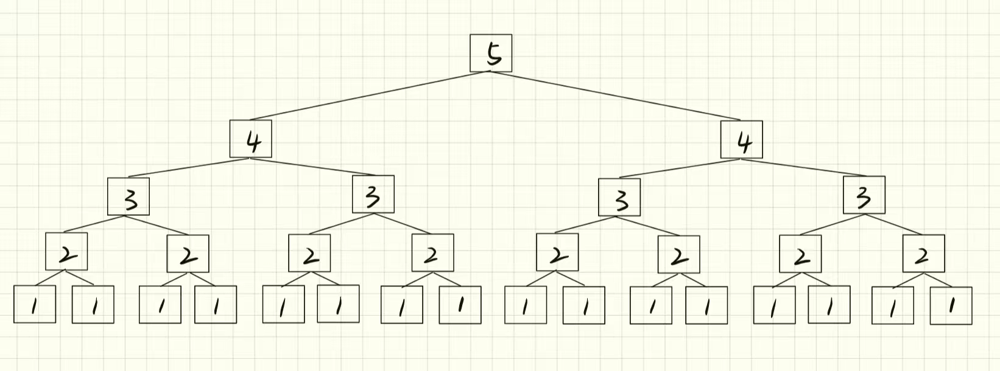

问题：找到一个简单的 f (N)使得下列代码的运行时间R(N) ∈ Θ(f (N))。(这里的 f(N) 不应该存在不必要的乘法常数或加法项) 


除了通过计算操作数，得到相应的表达式再进行化简的方法，还可以用 **“几何论证”** 的方法来寻得答案。

我们用一个**由方格组成的矩形**来表示这个操作，一条边表示`i`的值，另一条边表示`j`的值。当`i`和`j`的值同时满足要求时，代码才能执行，即相应的方格被填色。假设`N = 5`，则得到：


其中被涂色的方格所占的总面积的大小，就是这段代码在`N = 5`的条件下总共执行的操作数。

转换一下格式：


因为`i`始终以`x2`的方式增加，所以表格中`i`为单数的时候无效，代码不执行，操作数不变，直到下一次`i`为偶数时才增加。

我们将`N`的值增大，可以得到这样的一个表格：


其中，`C(N)`表示操作数，可以发现，操作数始终小于`2N`，且大于`0.5N`。

我们用更直观的方式来表示：



可以看到，`R(N)`始终被限制在`0.5N`和`N`之间，无论其以`2的幂次方`的形式增长多少次。因此，根据[大Θ表示法的定义](渐近线工具包.md#大Θ表示法)，它是线性的，也就是**∈ Θ( N )**。

也可以直接计算出精确解：
`1 + 2 + 4 + 8 + ... + N = 2N - 1`
故：
```
R(N) = Θ(1 + 2 + 4 + 8 + ... + N)
	= Θ(2N - 1)
	= Θ(N)
```

所以，不是所有的**两个嵌套的for循环**的时间复杂度都是`N的平方`。代码中的一小段语句的不同，都可能影响整段代码的运行时间。

没有万能公式或者捷径能够帮助我们迅速得到所有代码的时间复杂度，只有一步一步分析总结，才能得到准确的答案。通常有以下方法：

- 得到确切的运算总次数。
- 通过举例分析出准确的表达式。
- 画图分析。（使用几何直观的方法通常是更快、更直观地理解正在发生的事情的捷径）


## Recursion (Intuitive)

现在我们来讨论一下如何计算递归函数的运行时间。

举例：

```
public static int f3(int n){
	if(n <= 1){
		return 1;
	}
	return f3(n-1) + f3(n-1);
}
```

假设我们传递的参数为4，即`n = 4`，当我们执行一次代码时，由于`n > 1`，于是跳过if语句，执行`return f3(n-1) + f3(n-1)`，这意味着又需要执行两次`f3(3)`，以此类推，我们可以用**树**的形式来表示这个过程：


（每个子叶上的数字表示那一次调用的实参）

若我们将`n`再加1，其工作量几乎增加一倍：



所以我们推出，其总运行时间将是 $2^n$。 