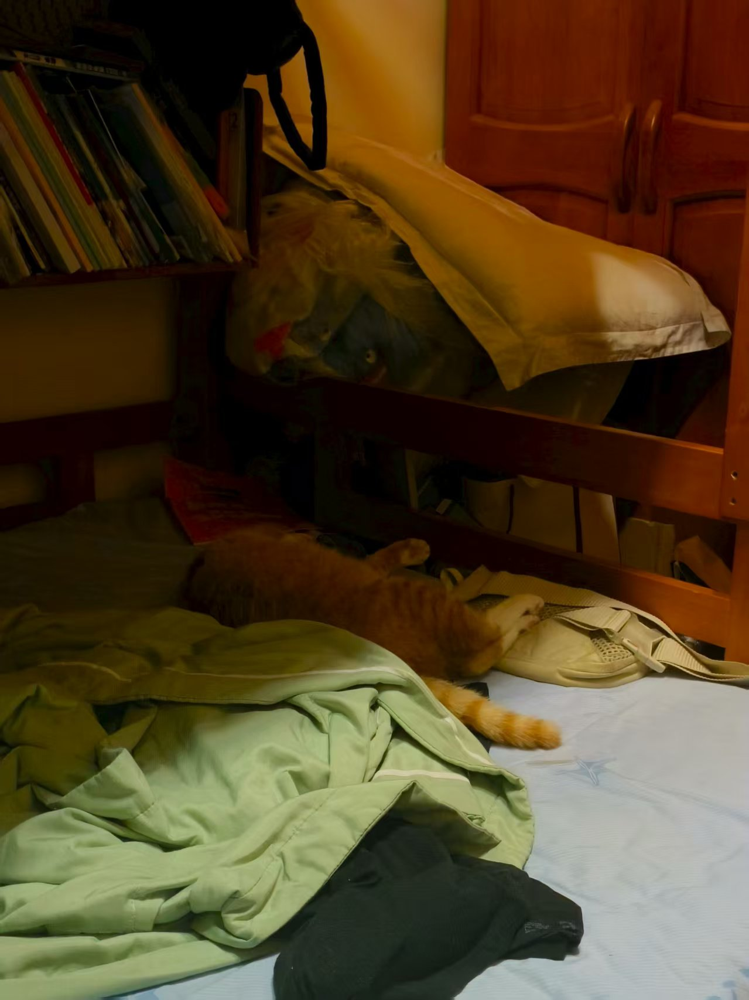

### 读

最近在读《被讨厌的勇气》这本书，还没读完。

这本书是以人物对话的形式展开，挺适合我，读起来不容易走神。

其中读到“自卑感”和”自卑情结“的区别，前者是，知道目前自己某些方面未达到自己理想状态，并把这种想法转化成自己向上发展的动力；而后者则是在知道自己某些方面不如意，并认为正是因为这些不完美才造成的现状而止步不前。

所以有自卑感不一定是坏事，它反而能激励我们自我发展。

自我反思后感到庆幸，自己应该是在“自卑感”这种阶段。例如我语言表达能力不好，想办法来提升......

感觉这本书真的很适合我，至少书中提到的很多思想或反应都是我拥有或经历过的。

### 🐖

现在是晚上十点五十八，我坐在我的房间的书桌边，在写这篇随笔，而梁咪咪就在我的床上睡觉。（附上一张美照）

好，现在梁咪咪开始打呼噜了。

梁咪咪真的很像一只🐖，且不说他的体型，圆滚滚的肚子。他的习惯，睡会起来吃点，吃了之后又睡，这样循环往复。特别是前面一段时间，大概睡二三十分钟就会起来进食一次。特别搞笑的是，今天他睡了那么久后，突然站起，直直地往装着肯德基的垃圾桶走去，没有丝毫犹豫，我怀疑他那时脑袋还没开机，身体就过去了，魂还在后面追呢，哈哈哈哈哈。

很想在家多陪梁咪咪，我能感受到他在家里最喜欢我了，或者说，在他的小世界里，最喜欢我。每次我隔那么长时间回一次家，梁咪咪就会跑到我身上来趴一会，用他的头贴着我的下巴，表示想念。有时会轻轻咬我，听说这是猫咪表达爱意的方式。

### 练车

今天傍晚去练了一次车，这是我拿驾照以来第一次开自家车，说实话有点紧张，但是自动挡比手动挡简单很多哈哈哈哈。我爸妈陪我一起练的。

其实现在和我爸的关系还比较僵。旅游前因为他早上催我，然后我很讨厌那种语气，已经到控制不了自己的那种地步。后面又是因为他开车看手机，我感觉他不负责任，毕竟一家人都在车上。然后我就吼了他。

那段时间确实很反感他，但是不讨厌他，不知道为什么，今天某个瞬间就没有这种感觉了，我也不知道是什么原因，但是我觉得我们两个都有问题，所以以后也不要愧疚了。

然后我突然想起了之前就发现了一点：只要我妈、我爸、我，我们三个中任意两个人闹矛盾，这两方对第三方都会比平时态度要好一些。

说的比较乱，把我今天心里想的一些写了下来，所以感觉也不好给这篇文章提名，就这样吧。

