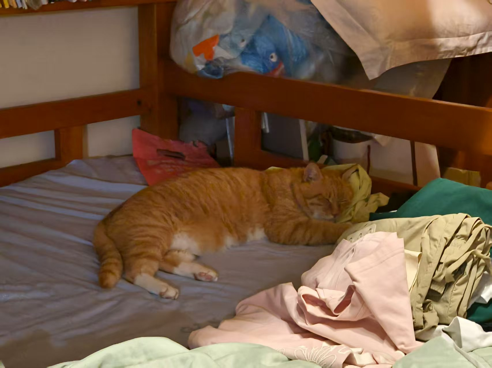

今天晚上又去练车了哈哈哈，直接从成外那边开到小区的停车场外，妈妈陪的我，感觉她还是有点紧张xswl。

以前开车在我心里的印象就是，机动车就得礼让行人，很平淡的和谐相处模式。但是今天晚上，遇见一些开电动车的人，有的横冲直撞，有的霸占机动车道，机动车又需要避开他们，感觉开车就是一门技术活。我老是害怕有非机动车撞上我哈哈哈。

希望我能早点熟练，就能到处去玩了。

写这篇随笔的时候，梁咪咪枕着我的睡裙躺在床上睡觉

感觉梁咪咪喜欢沾有我的味道的物品，想想都感觉很幸福。

明天就要去重庆了，梁咪咪或许又会被拴住，谁叫他乱撒尿。其实我也理解他，撒尿标记或许是喵喵界的传统，但奈何家人不能理解，我也买了除尿臭的。现在我只要回家就会把他放出来（撒尿就要栓一会），尽力给他自由的空间，我知道他不喜欢被拴住的感觉，希望以后有自己的小房子了，就把梁咪咪接过来住。