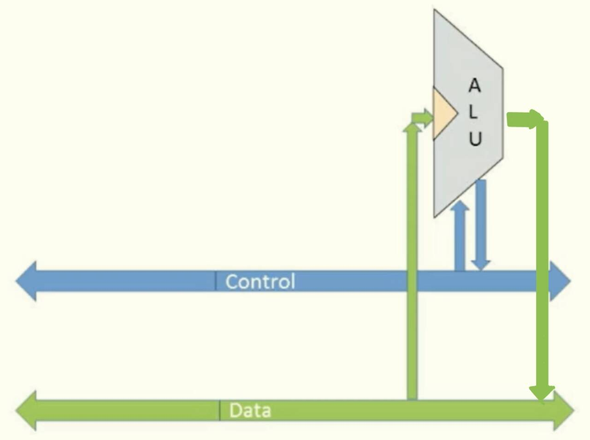
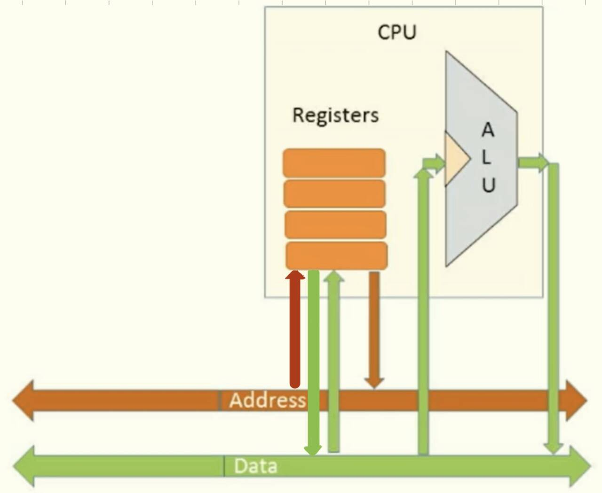

最令人惊讶的是 我们的计算机可以运行任何类型的程序任何类型的软件 计算机能够从软件获取指令然后运行这些指令。所以我们得到了一台非常灵活的机器 它可以做任何事情在理论层面，这种想法叫做通用**图灵机**，而真正实现它的架构则被称为**冯 · 诺伊曼结构**。我们这章将要构建这种结构。

上图则是这个通用的结构，我们如何实现这个结构呢，我们将获取一个很大的 `Memory` ，它将用来做两个事情：
- **存储Data（数据）**。存储我们将要在计算机中使用的各种数据
- **存储Program（指令）**。保持程序的一系列指令，这些指令将要按顺序一条一条地执行。 ^7b3d6d

除此之外，我们还需要有CPU（中央处理单元），它来执行这些指令，运行指令并控制everything。

接下来让我们更仔细看看这些时如何发生的，CPU是如何构建的，以及如何往复地进行控制。

### CPU的组成

我们的CPU主要由两个部分组成：
- ALU（算术逻辑单元），可进行算数运算和逻辑操作。
- A bunch of Register，可存储将被使用的数据。

`Memory` 则是两个部分：存储程序和存储数据。

为了了解这两个部分是如何操作的，我们不妨将其想成一个数据流，什么样的信息在计算机中需要从一边传递到另一边。

### 想象成数据流

通常有三种信息类型在系统中传递：
- data（数据）
- address（地址）
- instructions（指令）

当我们有一个数字，需要进行运算时，当然，这个数据需要从一个地方移动到另一个地方，从内存中移动到寄存器，到其他的系统的逻辑单元，对它们进行一些处理，然后返回。这就是`data`数据传递。

第二种的信息类型—— `address` 。我们现在执行的是什么指令？我们现在需要访问内存中的哪些数据？这些都在地址里。

第三种的信息类型—— `instructions` 。这将需要很多wires来进行所有的控制。它实际上就是告诉系统的每一个部分在特定的时间做些什么事。

通常这三种信息的传递都是通过wires实现的，我们称这些wires为 `bus` （总线）。

如上图，`data bus` 负责 `data values` 的运输；`address bus` 负责 `addresses` 的运输；`control bus` 负责 `instructions` 的运输。（ `control bus` 有时只是被称为`control wires`，即控制总线）

让我们将视线聚焦在计算机里面不同不为，看看它们能得到什么样的信息和发出什么样的信息。

#### ALU的信息传递

从概念上看，ALU（算术逻辑单元）是计算机 CPU 中最简单、最直观的部分。  它的主要任务是接收数字，对它们进行加减运算或逻辑运算。

所以，首先 `ALU` 会连接 `data bus` ，它从 **数据总线** 接收输入数据，执行运算后将结果输出，并将结果重新送回数据总线，方便内存、寄存器等其他部件使用。

`ALU` 还会连接 `control bus` ，因为 `ALU` 需要知道每次执行的是哪种操作（是算数计算还是逻辑计算，是加法还是减法），并且，它执行运算后的结果往往会用于告诉系统的其他部位执行什么操作，例如，如果它发现运算结果大于0，则执行指令的跳转 `jump` ，或者说通过分支[Branching](../机器语言/Branching、Variables%20and%20Iteration.md#Branching) 来决定下一个指令是什么。所以我们也需要从ALU中获取一些信息并将其反馈给控制系统的其余部分。

#### Register 的信息传递

寄存器在概念上非常简单，用来存储中间结果。因此它们需要能够从 **数据总线** 接收数据，也能够将数据输出到数据总线。比如把某个数据反馈给ALU，所以，我们不得不将所有寄存器都连接到数据总线。

除了普通寄存器，还有一些寄存器用于存储内存或程序的**地址**。它们可以通过 **地址总线** 与内存交互，从而实现间接寻址（Indirect Addressing），即先把地址放入寄存器，再去访问该地址对应的 RAM 或 ROM 单元。

这些寄存器可能是**纯地址寄存器**，也可能既存储地址又存储数据。

接下来讨论 `Memory`。

#### Memory的信息传递

内存主要有两类：
- 数据内存（Data Memory）——存储程序运行时的数据。
- 程序内存（Program Memory）——存储程序指令。

访问内存中的数据时，需要通过地址总线指定地址，然后通过数据总线进行读写。

我们再更深入地看看里面一共有两个部分的内存，一个是数据内存，一个是程序内存。

其中，数据内存，首先需要通过地址总线获取将要操作的数据的地址，然后再通过数据总线对其读或写：

其次是 `Program` 部分：

CPU 需要能够将**下一条指令的地址**放入地址总线，从程序内存中取回指令。取出的指令需要反馈到 **控制总线**，以便控制系统的其他部分。

纵观来看，如下图：

下一个单元的内容则是[取指-执行指令](取指-执行指令.md)。