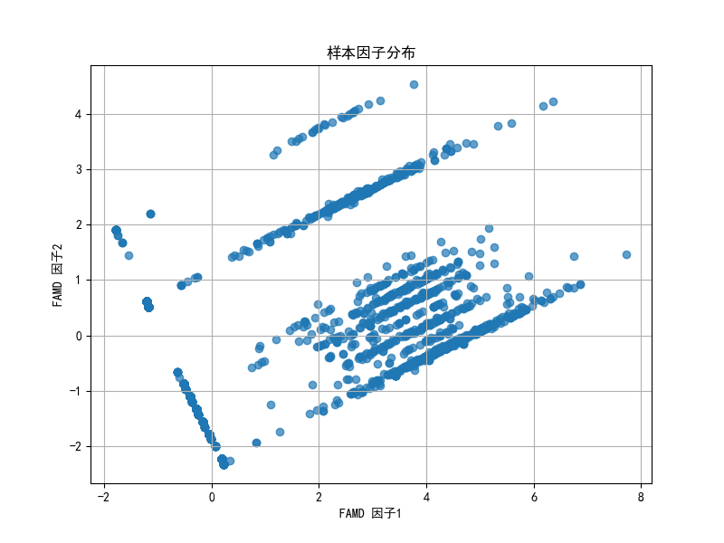
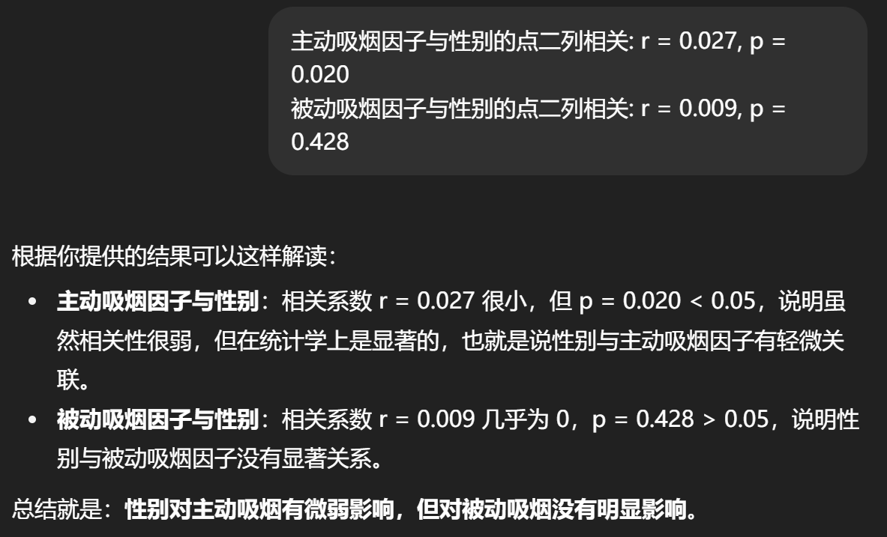

### 1、分析居民的生活习惯和饮食习惯是否与年龄、性别、婚姻状况、文化程度、职业等因素相关。

你这个问题其实就是**流行病学中典型的“影响因素分析”**。核心思路是把居民的生活习惯（如运动、吸烟、饮酒、睡眠）、饮食习惯（如蔬菜、水果、肉类、油盐摄入情况等）作为**因变量（被解释变量）**，把人口学因素（年龄、性别、婚姻状况、文化程度、职业等）作为**自变量（解释变量）**，通过统计方法分析两者是否存在显著相关性。

可以分为几个步骤来做：

**1. 数据整理**  
把附件A1问卷设计的变量和附件A2的调查结果整理成数据表格，比如：

- 生活习惯指标：是否规律运动、是否吸烟、是否饮酒、是否熬夜等。
    
- 饮食习惯指标：主食偏好、蔬菜水果摄入量、油盐摄入量、肉类摄入情况等。
    
- 人口学特征：年龄（可分组，如 18–29，30–44，45–59，60+）、性别、婚姻状况（已婚/未婚）、文化程度（小学、中学、本科及以上）、职业类别（脑力型/体力型/其他）。
    

**2. 描述性统计**  
先用频数表、交叉表、柱状图等方式，看看不同年龄、性别群体的生活和饮食习惯分布。例如：

- 男性吸烟率可能明显高于女性；
    
- 年龄越大，规律运动比例可能更高；
    
- 文化程度越高，水果和奶制品摄入率可能更高。
    

**3. 统计检验**

- 分类变量之间的相关性：常用 **卡方检验（Chi-square Test）**，例如分析“性别”和“是否吸烟”之间的关系。
    
- 顺序或数量变量：可以用 **方差分析（ANOVA）** 或 **t检验**，例如比较不同职业人群的平均运动时间。
    
- 多因素影响：可以用 **多元logistic回归**，将某个生活习惯（如是否规律运动）作为因变量，人口学特征作为自变量，检验哪些因素显著影响。
    

**4. 结果解读**  
得出哪些人口学因素与生活、饮食习惯显著相关：

- 年龄 → 饮食偏好差异明显，老年人更注意清淡饮食。
    
- 性别 → 男性吸烟、饮酒率高，女性更注重蔬果和营养搭配。
    
- 婚姻状况 → 已婚者饮食更规律，未婚者更可能外卖、快餐。
    
- 文化程度 → 教育水平高者更容易遵循《中国居民膳食指南》。
    
- 职业 → 体力劳动者可能主食和肉类摄入量大，脑力劳动者更倾向高热量快餐。
    

这样就能系统说明居民的生活和饮食习惯与人口学因素确实存在相关性。

但是在以下几种情况下，可以考虑**降维**：

1. **问卷指标很多、变量维度过高**：比如饮食习惯里有几十个问题（吃蔬菜频率、吃水果频率、吃油炸食品频率……），每个都单独分析会很冗长，这时候可以用==**主成分分析 (PCA)** ==或 **因子分析** 来把饮食习惯综合成几个因子（例如“高油高盐饮食因子”“均衡饮食因子”）。
    
2. **习惯之间高度相关**：比如“吸烟”和“饮酒”可能经常一起出现，或“少吃盐”和“多吃水果”在同一类健康意识下，这样多重共线性会影响回归分析，先做降维可以减少冗余。
    
3. **需要做聚类或模式识别**：如果你想把人群划分成“健康生活型”“高风险饮食型”“久坐不运动型”等，就需要先用降维方法提取特征，再做聚类。
    

总结：

- **如果只做相关性检验 → 不需要降维**。
    
- **如果想构建“饮食/生活方式综合指标”或者进行聚类、预测建模 → 可以降维**。

## 用FAMD进行降维

由于数据中既有连续性变量又有分类型变量，想要将这些变量降维，我们采取FAMD。

用 **FAMD（混合数据因子分析）** 特别适合你的问卷数据，既有数值型（吸烟支数、饮酒量、血糖等）又有分类型（性别、职业、婚姻、文化程度等）。我给你整理一个清晰的 **操作流程 + Python代码**，你照着跑就能得到结果。

---

## 🔹 一、FAMD 分析流程

1. **数据准备**
    
    - 把连续变量（如一天吸烟支数、饮酒量、BMI）保持原样。
        
    - 把分类变量（性别、职业、是否吸烟、是否饮酒）保持字符串类型，`prince.FAMD` 会自动识别并做编码。
        
    - 缺失值需要先处理（可以做填补或剔除）。
        
2. **执行 FAMD**
    
    - 提取主成分（通常取前 2–3 个因子，累计解释率 60% 以上）。
        
3. **结果解释**
    
    - **row_coordinates**：每个样本在新因子上的得分（可用于聚类、回归等）。
        
    - **column_correlations**：各变量对因子的贡献（解释因子的含义）。
        
    - **eigenvalues_**：各主成分的方差贡献率。
        
4. **结果可视化**
    
    - 绘制样本在前两个因子上的散点图，看是否存在明显分组（比如不同职业/性别是否分布差异）。
        
    - 画变量贡献度图，解释哪些变量影响最大。

## 吸烟
### 对于缺失值的处理

对于“记不清”这类值，有几种解决方法：

但我选择直接清除这些“记不清”的数据，原因如下：

丢掉“记不清”的人是为了 **提高数据质量和降维准确性**，尤其是在小部分异常值会显著影响连续变量方差时，这种做法非常合理。

根据统计，“记不清”的人数占总人数的百分之5点几，所以决定直接去掉“记不清”的数据。

开始吸烟年龄 与因子1相关: 0.888, 与因子2相关: 0.301
平均每周吸烟天数 与因子1相关: 0.934, 与因子2相关: 0.278
一天吸烟支数 与因子1相关: 0.870, 与因子2相关: 0.253
被动吸烟天数2 与因子1相关: 0.611, 与因子2相关: -0.730

是否吸烟
从未吸烟      -0.842935 -0.141161
吸烟         3.655730  0.691124
曾经吸烟      -0.604000 -0.414838

每个因子方差贡献率： [0.7138337510919935, 0.28616624890800646]      
因子1解释率: 0.7138
因子2解释率: 0.2862

### 综合分析结论

1. **主动吸烟行为（开始吸烟年龄、每周吸烟天数、一天吸烟支数）**主要由因子1表达。
2. **被动吸烟情况**主要由因子2表达。
3. 两个因子几乎覆盖了原始吸烟数据的全部信息（71% + 29% = 100%）。
4. 样本在因子空间的散点图可直观区分 **吸烟/曾吸/不吸人群**，同时可观察主动吸烟强度与被动吸烟暴露情况。

FAMD 就是专门为这种 **混合型数据（连续+分类）**设计的降维方法。

总结一句话：  
**FAMD就是帮你把“多维混合指标”的吸烟行为，浓缩成2个综合指标（因子），用来描述每个人的吸烟综合特征，同时还能保留原始信息的主要差异。**

## 饮食

### 对于食用类和频率的处理

我想对其进行分类：

 **一、谷薯类（主食类）**

- 大米
- 小麦面粉
- 杂粮（玉米、燕麦、荞麦等）
- 薯类（马铃薯、红薯、山药等）
- 油炸面食（油条、麻花、炸糕等）
- 糕点（蛋糕、饼干、点心等）

👉 特点：提供碳水化合物、部分膳食纤维，是主要能量来源。

---

 🍖 **二、畜禽肉类及其制品**

- 猪肉
- 牛肉和羊肉
- 禽肉（鸡、鸭、鹅等）
- 内脏类（肝、肾、心等）

👉 特点：提供优质蛋白质、铁、B族维生素。内脏胆固醇较高。

---

 🐟 **三、水产品**

- 水产品（鱼、虾、蟹、贝类等）
- 海草类（海带、紫菜等）

👉 特点：优质蛋白质、不饱和脂肪酸、碘、钙等。

---

 🥛 **四、奶类及制品**

- 鲜奶
- 奶粉
- 酸奶

👉 特点：钙和蛋白质的重要来源。

---

### 🥚 **五、蛋类**

- 蛋类（鸡蛋、鸭蛋、鹌鹑蛋等）

---

### 🌱 **六、大豆及制品**

- 豆腐
- 豆腐丝 / 千张 / 豆腐干
- 豆浆
- 干豆类（黄豆、黑豆、青豆等）

👉 特点：植物蛋白、不饱和脂肪酸、异黄酮。

---

### 🥦 **七、蔬菜类**

- 新鲜蔬菜
- 咸菜
- 泡菜
- 酸菜

👉 特点：维生素、矿物质、膳食纤维。  
⚠️ 咸菜/泡菜/酸菜属于 **腌制类蔬菜**，盐分较高。

---

### 🍎 **八、水果类**

- 新鲜水果

👉 特点：维生素C、膳食纤维。

---

### 🥤 **九、饮品类**

- 果汁饮料
- 其他饮料（碳酸饮料、功能饮料、茶饮料等）

---

 📌 这样分组的好处

1. **符合营养学标准**（和《中国居民膳食指南》一致），方便对比健康饮食模式。
2. **利于降维与聚类**：你可以先对每一大类提取因子，再做整体饮食模式分析。
3. **利于统计检验**：可以直接比较“奶类摄入 vs 性别”“肉类摄入 vs 职业”等。

## 对于身体锻炼

对于缺失值的处理：

 建议的处理方法
 
 #####  1. 分类变量（E1 工作强度, E2 家务强度, E3 体育锻炼频率, E4 锻炼强度）

- 如果缺失是逻辑性的：
    - E3=不参加 → E4/E5 直接设为 0（强度=0，时长=0）。
- 如果是真缺失：
    - 可以保留缺失（pandas 会是 NaN，FAMD 可以处理 NaN），或者用 **众数填补**。

---

##### 2. 连续变量（E5 平均每天体育锻炼时间）

- 如果 E3=不参加 → 直接设为 0。
    
- 如果 E3 有数据但 E5 缺失 → 可以用同类人群（相同 E3+E4） 的均值/中位数来填补。  
    例如：
    
    - 3–5 天/周，中等强度 → 平均 30 分钟/天
    - 1–2 天/周，大强度 → 平均 20 分钟/天

---

##### 3. 是否直接删除缺失值？

- 如果缺失比例 **<5%** → 可以直接丢掉
- 如果缺失比例 **>20%** → 丢掉会损失很多样本，最好做插补
- 如果缺失主要集中在某个变量（比如 E5） → 可以只在分析体育锻炼时考虑它

---

## 🔹 最终处理思路（推荐）

1. **逻辑填补**：
    - 不锻炼 → 强度=0，时间=0。
2. **小缺失插补**：
    - E1/E2 缺失 → 用众数补。
    - E5 缺失 → 用同类群体均值/中位数补。
3. **保留原始变量 + 构造新指标**：
    - 构造 “总体体力活动得分” 或 PAL（用 E1+E2+E3_E4_E5）。
    - 同时保留原始的 E1–E5，避免丢信息。

##### 1. 众数填补的逻辑

- 这些变量是 **分类变量（定类/定序）**，比如
    
    - E1（工作体力强度：轻度 / 中度 / 重度）
    - E2（家务活动强度：轻度 / 中度 / 重度）
    - E3（是否参加体育锻炼：不参加 / 1–2天 / 3–5天 / >5天）
    - E4（锻炼强度：大强度 / 中等强度）
        
- 对于分类变量来说：
    
    - **均值/中位数没意义**（比如“轻度=1，中度=2，重度=3”，中位数=2 其实没啥实质解释性）。
    - **众数** 表示“最常见的类别”，填补后保持了和总体分布一致，不会引入新的虚假类别。
        

举例：

- 如果 E1 缺失很多人 → 众数可能是 “轻度工作”。填补成轻度，符合总体规律。
- 如果填补成“中位数=2” → 其实隐含了“数值大小有线性含义”，容易误导。

---

##### 2. 众数填补的好处

- 简单直观，不会凭空“制造”数据分布。
- 保持样本量（避免丢弃）。
- 对大样本来说，不会对整体结果造成太大偏差。

#### 为什么 E5 用 “E3+E4 的组合均值” 填补？

1. **E5 和 E3、E4 有逻辑关联**
    - E3（是否参加体育锻炼 + 频率）
    - E4（锻炼强度）
    - 直观上：
        - E3=不参加锻炼 → E5 应该接近 0 或缺失
        - E3=1-2天/周 + E4=中等强度 → E5 平均值可能是 **20–30 分钟**
        - E3=>5天/周 + E4=大强度 → E5 平均值可能是 **60 分钟以上**  
            👉 所以用 E3+E4 作为“分层依据”，能让填补更符合实际锻炼习惯。

---

2. **为什么不用全局均值/中位数？**
    - 如果直接用整体均值（比如 35 分钟），那么：
        - 对“不参加锻炼”的人 → 明显填大了
        - 对“每天锻炼 >1 小时”的人 → 明显填小了
    - 这样会**扭曲 E5 的分布**，降低解释力。

---

3. **如果某个 E3+E4 组合样本太少 → 用总体中位数兜底**
    - 比如 E3=3–5天/周 + E4=大强度，样本只有 2 个，还都缺失了 → 没法算均值。
    - 这时就用总体中位数（稳健，不受极端值影响）。

---

## 🔹 总结

- **分类变量 (E1–E4)** → 众数填补（因为类别没有“平均”概念）
- **连续变量 (E5)** → 按相关条件（E3+E4）分层均值填补（更符合行为逻辑）
- **没有分层均值时 → 用总体中位数兜底**（稳健性）

## 饮酒

预处理：

#### 缺失值处理

对于“是否饮酒”为空白的

其中一个四种酒都不喝，判断其为不饮酒；另一个饮酒年数为22，则表示其会饮酒

## 饮食情况

你这个 **饮食情况问卷** 数据确实很典型：既有 **数量型**（如“几两、几斤、几天”），又有 **分类变量**（如“是否食用 1/2”，“就餐地点选择”），而且变量数量很多。直接分析维度太高，必须降维。思路如下：

---

##### 1. 数据类型划分

- **分类变量**
    
    - `是否食用`（1=是, 2=否）
        
    - `就餐地点`（在家/食堂/餐馆/带餐…）
        
- **数值变量**
    
    - 频率（b1 次/天, b2 次/周, b3 次/月 → 需要统一到“次/天”或“次/周”）
        
    - 平均食用量（两、斤、个、杯）
        
    - 家庭油盐调料（斤/月、两/月）
        

---

##### 2. 预处理

1. **统一频率单位**：把 `b1/b2/b3` 转换为统一的“次/周”或“次/月”。  
    例如：
    
    - `b1=1 次/天` → `7 次/周`
        
    - `b2=3 次/周` → `3 次/周`
        
    - `b3=5 次/月` → `5/4 ≈ 1.25 次/周`
        
2. **标准化量纲**：不同食物的单位不同（两、斤、个、杯），需要统一到“克”或“毫升”。
    
    - 1 两 ≈ 50 g
        
    - 1 斤 ≈ 500 g
        
    - 1 杯饮料 ≈ 250 ml
        
    - 蛋类、薯类可转成克（1 个鸡蛋 ≈ 50 g, 1 个土豆 ≈ 150 g）。  
        这样才能比较。
        
3. **缺失值处理**：
    
    - “否”就把频率和数量设为 0
        
    - 空缺的用 0 或中位数填补
        
4. **构造综合变量（可选）**
    
    - 把“油条/油饼”等细分类别合并成“油炸食品”
        
    - 把“咸菜/泡菜/酸菜”合并成“腌制类”
        
    - 把“牛羊肉/禽肉/猪肉”合并成“肉类总量”

#### 处理思路

这个问题问得特别好 👍。你的饮食数据里确实会出现：

- **情况 1**：`a=1(是)`，填了“每次食用量”，但 `b1/b2/b3` 全部空 → 有量无频率
    
- **情况 2**：`a=2(否)`，频率和食用量都应该是 0
    
- **情况 3**：有频率没填量（偶尔也会有）
    

这种情况不能简单直接设 0，因为 0 表示“不吃”，而这些人其实是吃的，只是频率没填。

---

#### 常见的处理思路

#### 🔹 方法 1：填充“缺省频率”

- 对有 **食用量但没频率** 的人，可以给一个最小频率，比如 **1 次/周** 或 **1 次/月**。
    
- 这样不会把他们误判为“不吃”，同时又不过度放大。
    

#### 🔹 ==方法 2：用同类人群均值/中位数填充==

- 按照人口学特征（性别、年龄段、城乡）分组，取该组里对这种食物的 **中位数频率** 填充。
    
- 好处：比固定 1 次/周更贴近真实饮食习惯。
    

#### 🔹 方法 3：构造“吃但频率未知”的类别

- 新增一个类别 `freq_missing=1`，然后频率先填 0。
    
- 在后续 **FAMD/MCA** 降维时，它会作为“分类变量”来表示“吃但频率未知”的特殊情况。
    

#### 🔹 方法 4：删除少量缺失

- 如果某个食物缺失率很低（<5%），可以直接删除这些样本，避免噪声。

对于这种缺失情况，根据大米的食用频率填入1

对于这种缺失情况，用2来填补

### 分类

**1. 碳水化合物类（主能量来源）**
- **谷物及薯类**：大米、小麦面粉、杂粮（小米、高粱、玉米、红豆等）、薯类（红薯、山药、芋头、土豆等）
- **高脂碳水零食**（可兼顾谷物类或单独零食类）：油炸面食、糕点

**理由**：主要提供能量，碳水化合物含量高。

---

**2. 蛋白质类**

- **动物蛋白**：猪肉、牛羊肉、禽肉、内脏、水产
- **蛋类**：蛋类
- **植物蛋白**：豆腐、豆腐丝、豆腐干、豆浆、干豆类

**理由**：提供蛋白质和部分脂肪、矿物质，豆类是优质植物蛋白。

---

**3. 脂肪类（高脂食品）**

- 植物油、动物油、油炸面食（也可归入碳水类，但高脂需要标注）

**理由**：能量密度高，主要提供脂肪。

---

**4. 乳制品类（蛋白质+钙）**

- 鲜奶、奶粉、酸奶

**理由**：蛋白质含量较高，同时提供钙质和部分脂肪。

---

**5. 蔬菜类（膳食纤维+维生素+矿物质）**

- 新鲜蔬菜、海草类
- 发酵蔬菜（咸菜、泡菜、酸菜）

**理由**：富含膳食纤维和维生素、矿物质。

---

**6. 水果类（膳食纤维+天然糖分+维生素）**

- 新鲜水果
- 果汁饮料（含糖饮料，虽然来源于水果，但纤维少，可单独标注“糖饮料”）

---

**7. 调味品类**

- 盐、酱油、醋、酱类、味精

**理由**：不作为主食或主菜，提供钠和调味功能。

**总结逻辑**：

- **碳水类** → 主能量来源
- **蛋白质类** → 动物和植物蛋白
- **脂肪类** → 高能量密度食品
- **乳制品** → 蛋白质+钙
- **蔬菜类** → 膳食纤维、维生素
- **水果类** → 自然糖+维生素
- **调味品** → 功能性调味

### 总结

| 主成分 | 方差    | 可能代表的饮食模式      |
| --- | ----- | -------------- |
| PC1 | 29.3% | 高蛋白 + 中等碳水摄入   |
| PC2 | 13.9% | 乳制品 + 水果偏好     |
| PC3 | 12.4% | 主食（碳水类）摄入量     |
| PC4 | 11.3% | 蔬菜水果摄入偏好       |
| PC5 | 10.5% | 碳水 + 乳制品组合模式   |
| PC6 | 6.4%  | 蛋白质补充 + 蔬菜混合模式 |

## 是否相关

#### 吸烟

与性别：
- 方法：==点二列相关==（point-biserial correlation）就是专门用来衡量 **二分类变量（性别）与连续变量（吸烟因子）之间的相关性** 的方法，非常适合你的场景。

- 结果：

- 代码文件名：smokingFenxi.py

与年龄：
- 方法：斯皮尔曼相关系数

与婚姻状况：
- 方法：[Kruskal-Wallis](../Kruskal-Wallis简介.md)
- 结论：

（“吸烟与婚姻状态”表格中有箱线图）

与文化程度：
- 方法1：斯皮尔曼相关系数：结果显示都没有相关性。
- 方法2：[Kruskal-Wallis](../Kruskal-Wallis简介.md)
	- 结论：

（若想放图，可以将“吸烟与文化程度”这个表格里面的箱线图放到论文中，效果挺明显）

与职业：
- 方法：[Kruskal-Wallis](../Kruskal-Wallis简介.md)、ANOVA
- Kruskal-Wallis的结果：

- [Kruskal-Wallis](../Kruskal-Wallis简介.md)与ANOVA的对比：
主动吸烟 Kruskal-Wallis H 检验结果: KruskalResult(statistic=149.19868940300992, pvalue=8.243374788217419e-26) 
被动吸烟 Kruskal-Wallis H 检验结果: KruskalResult(statistic=18.42946542256389, pvalue=0.10325908146702106) 
主动吸烟 ANOVA 结果: F_onewayResult(statistic=17.10304096035581, pvalue=9.240245195288828e-37) 
被动吸烟 ANOVA 结果: F_onewayResult(statistic=2.103144037893664, pvalue=0.013847199949489105)

